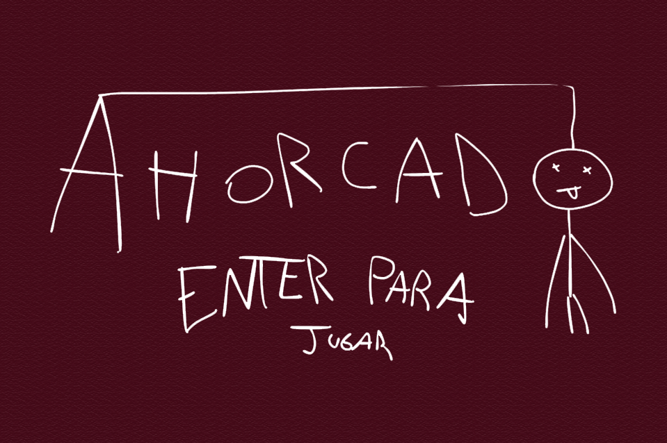

# Ahorcado

## Pixelados

- Alexis Giorda
- Alan Foa Rostirolla
- Enzo Nahuel Carnero
- Facundo Gre
- Lucas Cardona

## Capturas

## Reglas de Juego / Instrucciones

## Cómo Jugar

El juego consta de 3 niveles de dificultad. La dificultad aumenta con cada nivel, a medida que las palabras son más largas.

### Niveles

- **Nivel 1**: Palabras de 3 letras.
- **Nivel 2**: Palabras de 4 letras.
- **Nivel 3**: Palabras de 5 letras.

### Reglas

1. **Vidas**: Tienes 6 vidas.
2. **Adivinanza**:
    - Introduce una letra.
    - Letras correctas se muestran en su lugar.
    - Letras incorrectas restan una vida y dibujan una parte del cuerpo (cabeza, tronco, extremidades superiores e inferiores).
3. **Perder**: Pierdes si se completa el dibujo del cuerpo antes de adivinar la palabra.
4. **Ganar**: Adivina la palabra completa para pasar al siguiente nivel.
5. **Superar el Juego**: Si superas el Nivel 3, serás librado de la horca.

### Ejemplo de Juego

1. Comienza en el Nivel 1 con una palabra de 3 letras.
2. Introduce letras para adivinar la palabra.
3. Cada letra incorrecta resta una vida y dibuja una parte del cuerpo.
4. Si adivinas la palabra, avanzas al siguiente nivel.
5. Continúa hasta superar el Nivel 3.

¡Buena suerte y divertite!

## Otros

- Comision 2/UNAHUR
- Version 3.0.0
- Una vez terminado, no tenemos problemas en que el repositorio sea público.
